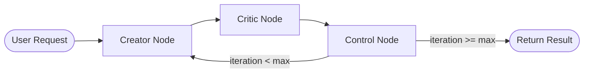

# PromptForge - Project Documentation

## Table of Contents
- [Overview](#overview)
- [Core Idea](#core-idea)
- [Architecture](#architecture)
- [Features](#features)
- [Tech Stack](#tech-stack)
- [Database Schema](#database-schema)
- [API Endpoints](#api-endpoints)
- [Agent System](#agent-system)
- [Frontend Components](#frontend-components)
- [Getting Started](#getting-started)

---

## Overview

**PromptForge** is an AI-powered prompt refinement system that uses a multi-agent workflow to iteratively improve user prompts through a Creator-Critic collaboration pattern. Built with modern technologies, it provides a seamless experience for transforming raw ideas into polished, production-ready prompts.

The application consists of two main parts:
- **Backend**: FastAPI-based API with LangGraph orchestration
- **Frontend**: Next.js application with a modern, dark-themed UI

---

## Core Idea

PromptForge addresses a common challenge in AI interactions: **writing effective prompts is hard**. The platform solves this by:

1. **Accepting raw, unstructured input** from users
2. **Applying iterative refinement** through AI agents
3. **Providing structured critique** with actionable feedback
4. **Delivering polished prompts** ready for production use

### The Creator-Critic Pattern

The core innovation is the dual-agent system:
- **Creator Agent**: Generates improved prompts based on feedback
- **Critic Agent**: Evaluates prompts and provides structured critique

This creates a feedback loop that progressively improves prompt quality over multiple iterations.

---

## Architecture

### System Architecture

```
┌─────────────────────────────────────────────────────────────────┐
│                        FRONTEND (Next.js)                        │
│  ┌─────────────┐  ┌─────────────┐  ┌─────────────────────────┐  │
│  │  Home Page  │  │ Refine Page │  │   UI Components         │  │
│  │  (Landing)  │  │  (Studio)   │  │   - Model Selector      │  │
│  │             │  │             │  │   - Iteration Cards     │  │
│  │             │  │             │  │   - Resizable Panels    │  │
│  └─────────────┘  └─────────────┘  └─────────────────────────┘  │
│                          │                                       │
│                          ▼                                       │
│  ┌─────────────────────────────────────────────────────────────┐│
│  │                    API Client Layer                          ││
│  │         /lib/api.ts + /lib/hooks/useRefinement.ts           ││
│  └─────────────────────────────────────────────────────────────┘│
└──────────────────────────────┬──────────────────────────────────┘
                               │ HTTP/REST
                               ▼
┌─────────────────────────────────────────────────────────────────┐
│                     BACKEND (FastAPI)                            │
│  ┌─────────────────────────────────────────────────────────────┐│
│  │                    API Layer                                 ││
│  │         /api/agents.py + /api/health.py                      ││
│  └─────────────────────────────────────────────────────────────┘│
│                          │                                       │
│                          ▼                                       │
│  ┌─────────────────────────────────────────────────────────────┐│
│  │                 Agent System (LangGraph)                     ││
│  │  ┌──────────┐    ┌──────────┐    ┌──────────┐               ││
│  │  │ Creator  │───▶│ Critic   │───▶│ Control  │──┐            ││
│  │  │  Node    │    │  Node    │    │  Node    │  │            ││
│  │  └──────────┘    └──────────┘    └──────────┘  │            ││
│  │       ▲                                         │            ││
│  │       └─────────────────────────────────────────┘            ││
│  │                    (Iterative Loop)                          ││
│  └─────────────────────────────────────────────────────────────┘│
│                          │                                       │
│                          ▼                                       │
│  ┌─────────────────────────────────────────────────────────────┐│
│  │                   Database Layer                             ││
│  │              PostgreSQL + SQLAlchemy ORM                     ││
│  └─────────────────────────────────────────────────────────────┘│
└──────────────────────────────┬──────────────────────────────────┘
                               │
                               ▼
                    ┌─────────────────────┐
                    │   OpenRouter API    │
                    │  (LLM Integration)  │
                    │  - OpenAI GPT       │
                    │  - Anthropic Claude │
                    │  - Google Gemini    │
                    │  - Meta Llama       │
                    │  - And more...      │
                    └─────────────────────┘
```

### Backend Architecture

```
backend/
├── app/
│   ├── agents/              # Agent system components
│   │   ├── graph.py         # LangGraph workflow definition
│   │   ├── state.py         # Agent state management
│   │   ├── llm.py           # LLM client configuration
│   │   └── tools.py         # Database persistence tools
│   ├── nodes/               # LangGraph node implementations
│   │   ├── creator.py       # Prompt creator node
│   │   ├── critic.py        # Prompt critic node
│   │   └── control.py       # Iteration control logic
│   ├── api/                 # FastAPI endpoints
│   │   ├── agents.py        # Main refinement endpoint
│   │   └── health.py        # Health check
│   ├── db/                  # Database layer
│   │   ├── models.py        # SQLAlchemy models
│   │   ├── session.py       # Database session management
│   │   └── init_db.py       # Database initialization
│   ├── core/                # Core utilities
│   │   └── logging.py       # Logging configuration
│   ├── config.py            # Application settings
│   └── main.py              # FastAPI application
└── scripts/
    ├── test_db_connection.py
    └── verify_openrouter.py
```

### Frontend Architecture

```
frontend/
├── app/
│   ├── page.tsx             # Landing page
│   ├── refine/
│   │   └── page.tsx         # Main refinement studio
│   ├── layout.tsx           # Root layout
│   └── globals.css          # Global styles
├── components/
│   ├── model-selector.tsx   # LLM model selection
│   ├── iteration-card.tsx   # Iteration display card
│   ├── reveal.tsx           # Animation component
│   └── ui/                  # Shadcn UI components
│       ├── button.tsx
│       ├── card.tsx
│       ├── dialog.tsx
│       ├── input.tsx
│       ├── textarea.tsx
│       ├── select.tsx
│       ├── badge.tsx
│       ├── alert.tsx
│       ├── scroll-area.tsx
│       ├── skeleton.tsx
│       └── resizable.tsx
└── lib/
    ├── api.ts               # API client
    ├── types.ts             # TypeScript types
    ├── utils.ts             # Utility functions
    └── hooks/
        └── useRefinement.ts # Refinement hook
```

---

## Features

### Core Features

#### 1. Iterative Prompt Refinement
- Configurable number of iterations (1-5)
- Progressive improvement through feedback loops
- History tracking of all iterations

#### 2. Dual-Model Architecture
- Separate models for Creator and Critic roles
- Mix and match models for optimal results
- Support for multiple LLM providers via OpenRouter

#### 3. Structured Critique System
- Quality scoring (1-10 scale)
- Identified strengths and weaknesses
- Actionable improvement suggestions

#### 4. Rich Input Options
- Primary prompt input
- Domain specification
- Goal definition
- Target audience
- Constraints and exclusions
- Tone selection (Analytical, Cinematic, Concise, etc.)

#### 5. Refinement Profiles
- **Quick**: 2 iterations for fast results
- **Balanced**: 3 iterations for standard use
- **Deep**: 5 iterations for thorough refinement

### UI/UX Features

#### Landing Page
- Hero section with value proposition
- Feature highlights
- Workflow explanation
- Live preview demonstration
- Signal metrics display

#### Refinement Studio
- Split-panel resizable interface
- Real-time word/character count
- Status indicators (Idle/Running/Complete)
- Iteration timeline with cards
- Final prompt display with copy functionality
- Loading skeletons for async states

#### Model Selector
- Provider-specific icons (OpenAI, Anthropic, Google, etc.)
- Model descriptions and capabilities
- Pricing information (input/output per 1M tokens)
- Search and filter functionality
- Recommended model badges

---

## Tech Stack

### Backend
| Technology | Purpose |
|------------|---------|
| **Python 3.13+** | Primary language |
| **FastAPI** | Web framework |
| **LangGraph** | Agent workflow orchestration |
| **LangChain** | LLM integration |
| **SQLAlchemy** | Database ORM |
| **asyncpg** | Async PostgreSQL driver |
| **Pydantic** | Data validation |
| **OpenRouter** | LLM API gateway |

### Frontend
| Technology | Purpose |
|------------|---------|
| **Next.js 16** | React framework |
| **React 19** | UI library |
| **TypeScript** | Type safety |
| **Tailwind CSS 4** | Styling |
| **Shadcn UI** | Component library |
| **Lucide React** | Icons |
| **React Markdown** | Markdown rendering |
| **Resizable Panels** | Split interface |

### Database
| Technology | Purpose |
|------------|---------|
| **PostgreSQL** | Primary database |
| **JSONB** | JSON storage for critiques |

---

## Database Schema

### Tables

#### `prompt_runs`
Stores each refinement request.

| Column | Type | Description |
|--------|------|-------------|
| `id` | TEXT (PK) | Unique run identifier |
| `mode` | TEXT | Refinement mode |
| `creator_model` | TEXT | Model used for creation |
| `critic_model` | TEXT | Model used for critique |
| `max_iterations` | INTEGER | Maximum iterations configured |
| `created_at` | DATETIME | Timestamp |

#### `prompt_iterations`
Stores each iteration within a run.

| Column | Type | Description |
|--------|------|-------------|
| `id` | TEXT (PK) | Unique iteration identifier |
| `run_id` | TEXT | Foreign key to prompt_runs |
| `iteration` | INTEGER | Iteration number |
| `prompt` | TEXT | Refined prompt text |
| `critique` | JSONB | Structured critique data |
| `score` | INTEGER | Quality score |
| `created_at` | DATETIME | Timestamp |

#### `prompt_memory`
Stores prompt snapshots for future use.

| Column | Type | Description |
|--------|------|-------------|
| `id` | TEXT (PK) | Unique prompt identifier |
| `title` | TEXT | Prompt title |
| `current_version` | INTEGER | Version number |
| `state` | JSONB | Full state snapshot |
| `updated_at` | DATETIME | Last update timestamp |

---

## API Endpoints

### Health Check
```http
GET /api/v1/health
```

**Response:**
```json
{
  "status": "ok"
}
```

### Refine Prompt
```http
POST /api/v1/prompt/refine
```

**Request Body:**
```json
{
  "prompt": "Your initial prompt",
  "mode": "user_defined",
  "creator_model": "anthropic/claude-3.5-sonnet",
  "critic_model": "openai/gpt-4o-mini",
  "iterations": 3
}
```

**Response:**
```json
{
  "run_id": "uuid",
  "final_prompt": "Improved prompt after iterations",
  "final_score": 8,
  "iterations": 3,
  "iterations_detail": [
    {
      "iteration": 1,
      "prompt": "First refinement...",
      "critique": {
        "score": 6,
        "strengths": ["Clear intent"],
        "weaknesses": ["Too vague"],
        "suggestions": ["Add specific constraints"]
      }
    }
  ]
}
```

---

## Agent System

### State Management

The agent state is shared across all nodes:

```python
class AgentState(TypedDict):
    original_prompt: str         # Initial user prompt
    current_prompt: str          # Current iteration's prompt
    critique: Optional[Critique] # Latest critique
    iteration: int               # Current iteration number
    max_iterations: int          # Maximum iterations
    creator_model: str           # LLM for Creator
    critic_model: str            # LLM for Critic
    history: List[Dict]          # Full iteration history
    metadata: Dict[str, Any]     # Additional metadata
```

### Critique Structure

```python
class Critique(TypedDict):
    score: int                   # 1-10 quality score
    strengths: List[str]         # What works well
    weaknesses: List[str]        # What needs improvement
    suggestions: List[str]       # Specific improvements
```

### Workflow



### Node Responsibilities

#### Creator Node
- Receives original prompt and previous critique
- Generates improved prompt using LLM
- Focuses on clarity, specificity, and structure
- Returns only the improved prompt text

#### Critic Node
- Evaluates current prompt quality
- Provides structured JSON feedback
- Scores on 5 criteria (2 points each):
  - Clarity
  - Specificity
  - Structure
  - Completeness
  - Actionability
- Includes fail-safe for invalid responses

#### Control Node
- Increments iteration counter
- Records history for each iteration
- Determines termination condition
- Routes to Creator or End

---

## Frontend Components

### Key Components

#### ModelSelector
A dialog-based model selection component featuring:
- Provider filtering (OpenAI, Anthropic, Google, etc.)
- Model search functionality
- Capability badges (reasoning, vision, fast, context)
- Pricing display
- Recommended model indicators

#### IterationCard
Displays individual refinement iterations:
- Iteration number badge
- Quality score with color coding
- Refined prompt display (markdown)
- Critique section with strengths/weaknesses/suggestions

#### useRefinement Hook
Custom React hook managing:
- API calls to backend
- Loading states
- Error handling
- Iteration data transformation
- Session reset

---

## Getting Started

### Prerequisites
- Python 3.13+
- Node.js 18+ / Bun
- PostgreSQL database
- OpenRouter API key

### Backend Setup

```bash
cd backend

# Install dependencies
uv sync

# Configure environment
cp .env.example .env
# Edit .env with your credentials

# Initialize database
uv run python -m app.db.init_db

# Start server
uv run uvicorn app.main:app --reload --port 8000
```

### Frontend Setup

```bash
cd frontend

# Install dependencies
npm install
# or
bun install

# Configure environment
# Set NEXT_PUBLIC_API_BASE in .env.local

# Start development server
npm run dev
# or
bun dev
```

### Environment Variables

#### Backend
| Variable | Description | Required |
|----------|-------------|----------|
| `DATABASE_URL` | PostgreSQL connection string | Yes |
| `OPENROUTER_API_KEY` | OpenRouter API key | Yes |
| `APP_NAME` | Application name | No |
| `DEBUG` | Debug mode | No |
| `API_V1_STR` | API prefix | No |
| `ENV` | Environment | No |

#### Frontend
| Variable | Description | Required |
|----------|-------------|----------|
| `NEXT_PUBLIC_API_BASE` | Backend API URL | No (defaults to localhost:8000) |

---

## License

[Add your license here]

## Contributing

[Add contribution guidelines here]
