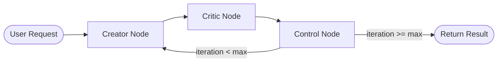

# Agent System Architecture

## Overview

PromptForge uses **LangGraph** to implement a cyclic multi-agent workflow for iterative prompt refinement. The system orchestrates collaboration between a Creator agent (generates improved prompts) and a Critic agent (evaluates and provides feedback).

## Agent Workflow



## System Components

### 1. Agent State (`agents/state.py`)

The state is shared across all nodes and tracks the refinement process:

```python
class AgentState(TypedDict):
    original_prompt: str         # Initial user prompt
    current_prompt: str          # Current iteration's prompt
    critique: Optional[Critique] # Latest critique from Critic
    iteration: int               # Current iteration number
    max_iterations: int          # Maximum iterations to run
    creator_model: str           # LLM model for Creator
    critic_model: str            # LLM model for Critic
    history: List[Dict]          # Full iteration history
    metadata: Dict[str, Any]     # Additional metadata (run_id, etc.)
```

**Critique Structure**:

```python
class Critique(TypedDict):
    score: int                   # 1-10 quality score
    strengths: List[str]         # What works well
    weaknesses: List[str]        # What needs improvement
    suggestions: List[str]       # Specific improvement suggestions
```

### 2. Graph Definition (`agents/graph.py`)

The LangGraph workflow defines the agent execution flow:

```python
def build_prompt_graph():
    graph = StateGraph(AgentState)

    # Add nodes
    graph.add_node("creator", creator_node)
    graph.add_node("critic", critic_node)
    graph.add_node("control", control_node)

    # Define flow
    graph.set_entry_point("creator")
    graph.add_edge("creator", "critic")
    graph.add_edge("critic", "control")

    # Conditional routing
    graph.add_conditional_edges(
        "control",
        should_continue,
        {
            "creator": "creator",  # Loop back
            "end": END,            # Terminate
        }
    )

    return graph.compile()
```

**Execution Flow**:

1. Starts at `creator` node
2. Flows to `critic` node
3. Flows to `control` node
4. Either loops back to `creator` or terminates

### 3. Node Implementations

#### Creator Node (`nodes/creator.py`)

**Purpose**: Generate improved prompts based on previous critique

```python
async def creator_node(state: AgentState) -> AgentState:
    llm = get_openrouter_llm(state["creator_model"])

    prompt = f"""
    You are a prompt engineering expert.

    Original prompt:
    {state["original_prompt"]}

    Previous critique:
    {state.get("critique")}

    Improve the prompt accordingly.
    Return ONLY the improved prompt.
    """

    response = await llm.ainvoke(prompt)
    state["current_prompt"] = response.content
    return state
```

**Key Features**:

- Uses configurable LLM model
- Considers both original prompt and latest critique
- Returns only the improved prompt (no meta-commentary)

#### Critic Node (`nodes/critic.py`)

**Purpose**: Evaluate prompts and provide structured feedback

```python
async def critic_node(state: AgentState) -> AgentState:
    llm = get_openrouter_llm(state["critic_model"])

    prompt = f"""
    Evaluate the following prompt.

    Return ONLY valid JSON.
    No markdown. No commentary.

    JSON schema:
    {{
      "score": number (1-10),
      "strengths": list of strings,
      "weaknesses": list of strings,
      "suggestions": list of strings
    }}

    Prompt:
    {state["current_prompt"]}
    """

    response = await llm.ainvoke(prompt)
    raw = response.content.strip()

    try:
        critique = json.loads(raw)
    except Exception:
        # Fail-safe: Never crash the system
        critique = {
            "score": 5,
            "strengths": [],
            "weaknesses": ["Critic returned invalid JSON"],
            "suggestions": [],
            "raw_output": raw,
        }

    state["critique"] = critique
    return state
```

**Key Features**:

- Enforces structured JSON output
- Includes fail-safe for invalid responses
- Provides actionable feedback

#### Control Node (`nodes/control.py`)

**Purpose**: Manage iteration counting and workflow termination

```python
async def control_node(state: AgentState) -> AgentState:
    current_iteration = state.get("iteration", 0)
    return {
        **state,
        "iteration": current_iteration + 1,
    }

def should_continue(state: AgentState) -> str:
    iteration = state.get("iteration", 0)
    max_iterations = state.get("max_iterations", 0)

    if iteration >= max_iterations:
        return "end"
    return "creator"
```

**Key Features**:

- Increments iteration counter
- Determines whether to continue or terminate
- Simple, deterministic logic

### 4. LLM Client (`agents/llm.py`)

Configures OpenRouter integration:

```python
def get_openrouter_llm(model: str):
    return ChatOpenAI(
        base_url="https://openrouter.ai/api/v1",
        api_key=settings.OPENROUTER_API_KEY,
        model=model,
        temperature=0.7,
        default_headers={
            "HTTP-Referer": "http://localhost",
            "X-Title": "PromptForge",
        },
    )
```

**Supported Models** (via OpenRouter):

- `openai/gpt-4o`
- `openai/gpt-3.5-turbo`
- `anthropic/claude-3-opus`
- `anthropic/claude-3-sonnet`
- And many more...

### 5. Database Tools (`agents/tools.py`)

LangChain tools for persistence (currently unused in main workflow):

- `search_existing_prompt`: Search for similar prompts
- `persist_prompt`: Save prompt snapshots
- `persist_iteration`: Save individual iterations

## Execution Example

### Request

```json
{
  "prompt": "Write a story",
  "mode": "creative",
  "creator_model": "openai/gpt-4o",
  "critic_model": "openai/gpt-4o",
  "iterations": 3
}
```

### Iteration Flow

**Iteration 0 → 1**:

1. Creator generates improved prompt
2. Critic evaluates: `{"score": 6, "weaknesses": ["Too vague"], ...}`
3. Control increments counter to 1

**Iteration 1 → 2**:

1. Creator uses critique to improve further
2. Critic evaluates: `{"score": 8, "weaknesses": ["Minor clarity issues"], ...}`
3. Control increments counter to 2

**Iteration 2 → 3**:

1. Creator refines based on feedback
2. Critic evaluates: `{"score": 9, "strengths": ["Clear, specific"], ...}`
3. Control increments counter to 3

**Termination**:

- Control checks: `iteration (3) >= max_iterations (3)` → returns `"end"`
- Graph terminates and returns final state

### Response

```json
{
  "run_id": "uuid",
  "final_prompt": "Write a compelling 500-word short story...",
  "iterations": 3
}
```

## Design Principles

### 1. Stateless Nodes

Each node is pure: it receives state and returns modified state. No side effects within nodes (database writes handled separately).

### 2. Fail-Safe Operations

- Critic has JSON parsing fallback
- Async session management prevents connection leaks
- LangGraph handles recursion limits (max 25)

### 3. Configurable Models

Users can mix and match models:

- Use GPT-4 for creation, GPT-3.5 for critique
- Use Claude for both
- Experiment with different combinations

### 4. Structured Output

Critic enforces JSON schema for consistent, parseable feedback that can be:

- Displayed in UI
- Stored in database
- Used for analytics

## State Management

### Initial State

Constructed in the API endpoint:

```python
initial_state = {
    "original_prompt": request.prompt,
    "current_prompt": request.prompt,
    "critique": None,
    "iteration": 0,
    "max_iterations": request.iterations,
    "creator_model": request.creator_model,
    "critic_model": request.critic_model,
    "history": [],
    "metadata": {"run_id": run_id},
}
```

### State Updates

Each node modifies only relevant fields:

- Creator updates `current_prompt`
- Critic updates `critique`
- Control updates `iteration`

### Final State

Returned after graph execution completes:

```python
final_state = await graph.ainvoke(initial_state)
```

## Error Handling

### LLM Failures

- Critic node has JSON parsing fallback
- OpenRouter API errors propagate to FastAPI error handlers

### Database Failures

- Async session management with proper cleanup
- Transaction rollback on errors
- Connection pooling prevents exhaustion

### Recursion Limits

- LangGraph enforces max 25 iterations (hardcoded safety)
- Application enforces user-specified `max_iterations`
- Control node ensures proper termination

## Future Enhancements

### Potential Improvements

1. **Dynamic Termination**: Stop early if critique score is consistently high
2. **History Tracking**: Store full iteration history in state
3. **Multi-Critic**: Use multiple critics for diverse feedback
4. **Tool Usage**: Enable agents to use web search, code execution, etc.
5. **Streaming**: Stream intermediate results to frontend in real-time
6. **Embeddings**: Use semantic similarity to find related prompts
7. **Analytics**: Track model performance, iteration effectiveness

### Extensibility

The architecture supports:

- Adding new node types (e.g., Analyzer, Validator)
- Implementing branching workflows
- Creating specialized graphs for different tasks
- Integrating external tools and APIs

## References

- [LangGraph Documentation](https://langchain-ai.github.io/langgraph/)
- [OpenRouter API](https://openrouter.ai/docs)
- [FastAPI Documentation](https://fastapi.tiangolo.com/)
- [Pydantic TypedDict](https://docs.pydantic.dev/latest/concepts/types/)
